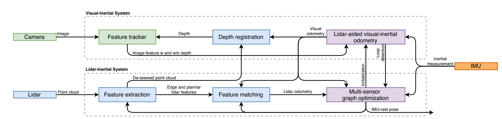
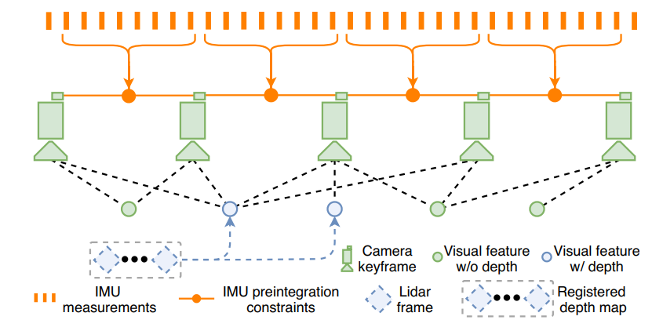

# LVI-SAM

## Abstract

| Words      | Translation         |
| ---------- | ------------------- |
| leverages  | v. 杠杆作用（利用） |
| facilitate | v. 促进             |
|            |                     |
|            |                     |
|            |                     |
|            |                     |
|            |                     |

​	我们提出了一个通过平滑以及建图实现**激光-视觉-惯性**里程计的紧耦合框架LVI-SAM，其可以达到实时高准确度以及鲁棒的状态估计和建图。

​	**LVI-SAM采用因子图**，其包括两个子系统：①VIS ②LIS 。这两个子系统被设计为紧耦合的，其中，VIS 利用 LIS 估计来促进初始化。

​	VIS部分中，利用雷达测量数据提取视觉特征点的深度信息，以此来提高精度。同时，LIS利用VIS提供初值进行scan-matching，并作为点云配准的初始值。回环检测先由VIS进行，再由LIS细化。

​	LVI-SAM可以在两个子系统中的一个子系统失效时继续运行，这提高了在**纹理少或特征少的环境中的鲁棒性**。

## I. INTRODUCTION

#### Related Work

| Words             | Translation |
| ----------------- | ----------- |
| perceptual sensor | 感知传感器  |
| account for       | 解决        |
| attract           | 吸引        |
| pipeline          | 管道        |
| **recursively**   | **递归地**  |
| degradation       | 降解、退化  |
|                   |             |

​	SLAM在移动机器人中很重要，近年来，该领域有很多成就。

​	**基于雷达的SLAM方法可以在长时间获取很多好的环境细节。**但是，会在少结构的环境下失效，例如走廊或者宽阔的平地（扫不到点了）。

​	**基于视觉的SLAM方法在纹理丰富的环境表现良好，且适合place recognition**，但是其对光照敏感、快速运动下会导致图像模糊，且需要初始化方案。

​	由于上述两个原因，视觉和激光的SLAM总喜欢与IMU数据结合，来提高准确度以及鲁棒性。

​	激光惯性系统可以帮助矫正点云畸变，并在短时间内解决缺乏特征的问题。可以通过 IMU 测量恢复公制尺度和姿态，以辅助视觉惯性系统。为了进一步提高系统性能，激光雷达、摄像头和 IMU 测量的融合越来越受到关注

​	我们的工作与VIO与LIO以及LVIO有关。**VIO可以分为两大类：基于滤波的和基于优化的**。基于滤波的方法一般使用EKF来传播系统的状态。基于优化的方法主要为滑动窗口状态估计，最小化视觉重投影误差以及IMU预积分误差。

​	在我们的工作中，我们限定：相机是单目的。

​	

​	**LIO也可以分为两大类：松耦合的以及紧耦合的。**LOAM和LeGO-LOAM是松耦合的，因为IMU测量没有用于优化。紧耦合系统有更高的准确度以及鲁棒性，是研究热门。

​	在公开可用的紧耦合系统中，**LIO-mapping [13]** 采用了 [8] 的优化流程，并最大限度地减少了 IMU 和激光雷达测量的残差。由于LIO-mapping优化了所有测量，因此不能保证实时性。

​	**LIO-SAM**引入了激光雷达关键帧的滑动窗口来限制计算复杂度，利用因子图来联合 IMU 和激光雷达的约束进行优化。

​	**LINS**主要给地面交通工具设计，用了error-state KF 递归地矫正机器人状态。

​	*介绍了一些当前的LVI方案*。我们的工作与上述工作不同，因为我们利用因子图进行全局优化，可以通过闭环检测定期消除机器人产生的漂移。

#### Our Work

​	我们利用因子图进行全局优化，可以通过回环检测定期消除机器人产生的漂移。在本文中，我们提出了一个通过平滑和映射实现紧密耦合激光雷达视觉惯性里程计的框架 LVI-SAM，用于实时状态估计和建图。LVI-SAM 建立在因子图之上，由两个子系统组成，一个视觉惯性系统 (VIS) 和一个激光雷达惯性系统 (LIS)。当检测到其中一个子系统出现故障时，这两个子系统可以独立运行，或者在检测到足够多的特征时联合运行。

​	VIS 执行视觉特征跟踪，并可选择使用激光雷达帧提取特征深度。通过优化视觉重投影和 IMU 测量误差获得的视觉里程计可作为激光雷达scan-matching的初始猜测，并将约束引入因子图中。在使用 IMU对点云进行去畸变后，LIS提取激光雷达边缘和平面特征，并将它们与在滑动窗口中维护的特征图相匹配。LIS 中估计的系统状态可以发送到 VIS 以促进其初始化。

​	对于回环检测，候选匹配首先由 VIS 识别，并由 LIS 进一步优化。视觉里程计、激光雷达里程计、IMU 预积分和回环的约束在因子图中联合优化。最后，利用优化的IMU偏差项来传播IMU测量值，以IMU帧率进行姿态估计。

**我们主要的贡献：**

- 一个基于因子图构建的紧耦合LVIO框架，在位置识别的辅助下实现多传感器融合和全局优化
- 我们的框架通过故障检测绕过故障子系统，使其对传感器退化具有鲁棒性
- 我们的框架已通过在不同规模、平台和环境中收集的数据进行了广泛验证。

## II. LIDAR VISUAL INERTIAL ODOMETRY VIA SMOOTHING AND MAPPING

| Words      | Translation |
| ---------- | ----------- |
| divergence | 分歧        |
|            |             |
|            |             |

### A. System Overview 概述

从3D激光雷达、单目相机和IMU中获取数据。

**主要两个子系统：：VIS和LIS**

​	VIS处理IMU和相机数据，最小化视觉和IMU测量误差来实现优化。LIS提取雷达信息特征，通过匹配特征地图给出激光雷达里程计。特征地图由实时滑动窗口维护。最后，状态估计问题(MAP最大后验)，由优化视觉、雷达、IMU预积分误差得到。因子图中的回环约束用 iSAM2[21]中的算法实现。

​	注意到，LIS 中采用的多传感器图优化旨在减少数据交换并提高系统效率。

### B. Visual-Inertial System

视觉特征点用[22]中提到的角点检测方法检测，并且用 Kanade-Lucas-Tomasi算法跟踪。

​	VIS初始化之后，我们把激光帧中的特征深度，用来给视觉算法做视觉特征点深度估计。**系统使用滑动窗口BA实现，其中，系统状态如下：**
$$
x=[R,p,v,b]
$$
其中，R是李代数，代表旋转矩阵。p是位置向量(3维)，v是速度，b是IMU的a、w偏置。T是SE(3)，表示为[R|p]，传感器坐标系到世界坐标系的转换。

#### (1) Initialization: 

#### (2) Feature depth association:

